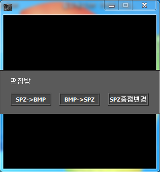

# Jurassic Primitive War 2 SPZ Editor

An editor that converts Jurassic Primitive War 2's unit image files (SPZ) to BMP and edited BMPs back to SPZ.

The analysis is written up in [docs/spz-format.md](docs/spz-format.md).

<p>
  
</p>


## How to use

Download from Releases, extract and run it, and it offers three modes.

`SPZ->BMP` asks for the `.pnt` that holds the colors, the folder with the SPZ files, and a folder to save into, then converts every SPZ in the folder to BMP. A `세부사항.txt` is written alongside, listing that PNT's transparent color, shadow color and ten player colors.

`BMP->SPZ` asks for the folder with the BMPs, a name for the PNT to save, and a folder to save into, then converts them all back. Colors are configured in the bundled `옵션.ini`.

`SPZ중점변경` picks a single SPZ and changes only its center and collision point coordinates.

When converting back, the whole BMP must use no more than 256 colors.


## How it works

**The format folds transparent runs into a count.** A pixel is one byte of palette index. Index 0 means transparent, and it is followed by one byte of repeat count. A unit image occupies only a small part of its rectangle, so most of it is transparent, and this single rule already shrinks the size a lot.

```gml
xred[i, k] = file_bin_read_byte(abc)

if xred[i, k]=0                       // transparent: the next byte is the repeat count
{
  vars2 = file_bin_read_byte(abc)
  for(u=0; u!=vars2; u+=1){ xred[i, k+u]=0 }
  k += vars2-1
}
```

**Palette numbers are written reversed.** In a PNT, slot 0 is always transparent and slot 1 always shadow, and the rest fill in from the end. So when writing an index into an SPZ, 0 and 1 stay as they are and everything else becomes `257 - number`. This keeps transparency at slot 0 so the run length rule holds.

```gml
if argument1=0 or argument1=1
{
  file_bin_write_byte(argument0, argument1)
}
else
{
  file_bin_write_byte(argument0, 255-argument1+2)
}
```

**The center and collision point are stored as negatives.** They are 4 byte values in two's complement, so read naively they come out in the 4.2 billion range. Subtracting from `4294967296` gives the real coordinate, and writing does the reverse.

```gml
posxx = abs(real(sk_dec_conversion(...)) - 4294967295 - 1)
```

**BMP writing is handed off outside GameMaker.** Writing pixels one byte at a time with GML's `file_bin_write_byte` meant hundreds of thousands of iterations per image, which was far too slow. So GML dumps the raw RGB stream to `spz.tmp` and writes only the 54 byte BMP header itself, and the row flipping and 4 byte alignment padding are left to a separately built `RGBtoBMP`. It is invoked through `RunSilent` from `silent_dos.dll`, bound with `external_define`, so no console window pops up.

```gml
// stdos_dll_init.gml
global.stdos_cmd = external_define(argument0, 'RunSilent', dll_stdcall, ty_real, 2, ty_string, ty_string)

// call site
stdos_command("RGBtoBMP.dll",
  chr(34)+dir+"\"+"spz.tmp"+chr(34)+" "+chr(34)+string(bmp)+chr(34)+" "
  +chr(34)+string(posx)+chr(34)+" "+chr(34)+string(su)+chr(34), 1)
```

`RGBtoBMP.dll` is a dll in name only. It is really a console executable, and the original file name was kept.

**Color settings live in an ini.** The transparent color, shadow color and ten player colors are read from `옵션.ini`. Whether shadow is flattened to transparent when extracting from SPZ is set there too. Units use different colors, so this lets them be changed without touching the program.


## Files

| Path | Contents |
|---|---|
| `source/jw2-spz-editor.gmk` | Original project file |
| `source/split/` | Text tree produced by GmkSplitter |
| `source/RGBtoBMP.dll`, `source/silent_dos.dll` | External library and helper executable needed at run time |
| `docs/spz-format.md` | SPZ format analysis |
| `docs/screenshots/` | Screenshots |
| Releases | Executable, DLLs, options file and usage notes |


## Credits

`silent_dos.dll` was made by TGMG of the GameMaker community. `RGBtoBMP.dll` is the author's own.


## License

zlib. See [LICENSE](LICENSE). Bundled libraries made by other people keep their own licenses.
